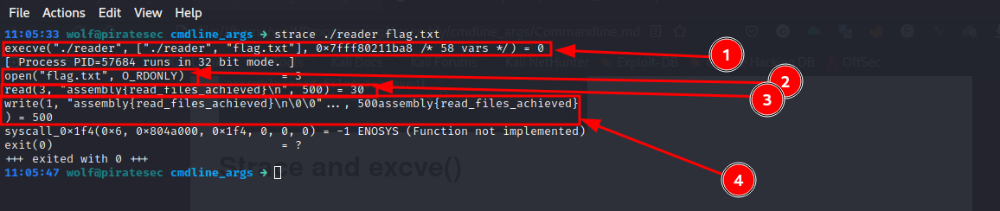

# Commandline Arguments
Normally, when we want to pass commandline arguments to a program we call the program followed by the argument(s).
To understand what is going on I have written a simple program that will take file name as an argument from the Commandline, read and display it's contents to the commandline. Then we're going to debug the binary with strace and gdb to see what's going on.

The program is called reader and it's assembled as a 32 bit program while the file we are going to read is called flag.txt.

# Strace and GDB

**Strace**

**GDB**

# Strace and GDB explained

Running the program with strace, execve() is being called with **"./reader"** and **["./reader","flag.txt"]** as its parameters.

**Structure of  [execve()](https://man7.org/linux/man-pages/man2/execve.2.html)**

**execve**

1. is used to execute a program
2. takes three arguments where the first two are our main concern which are **pathname** and **argv[]**
3. pathname must be either a binary executable, or a script
4. argv is an array of pointers to strings passed to the new program as its command-line arguments.  By convention, the first of these strings (i.e., argv[0]) should contain the filename associated with the file being executed.

In the gdb output, I've set the breakpoint at **_start** where the program instructions are, so no instruction has run yet. Postion 1 in the gdb output shows the current position of the stack pointer which is at **0x3**.

If you know how the stack works, you know the stack grows downwards, which means it starts from a high memory address growing downwards to a lower memory address. This is evident by position 2 and 3 in the gdb output.

Checking the contents of the stack at gdb output 3, we see that the file we are reading is at position **0012** while the stack pointer is at **0000** meaning we have to do **stack pointer + 8** (0012-0004)to get the first parameter.

From all this, it's safe to say that when a program with commandline arguments is executed, execve places the number of arguments, pathname of the program and the program's arguments onto the stack and If we're going to write an assembly program with commandline arguments, to access these arguments we have to use the stack pointer like this:

* stack pointer + 0 = path to program
* stack pointer + 4 = program being executed
* stack pointer + 8 = first parameter
* stack poineter + 12 + _ _ so on _ _ = other parameters

The **reader** program source code can be found at [reader](reader.s)

